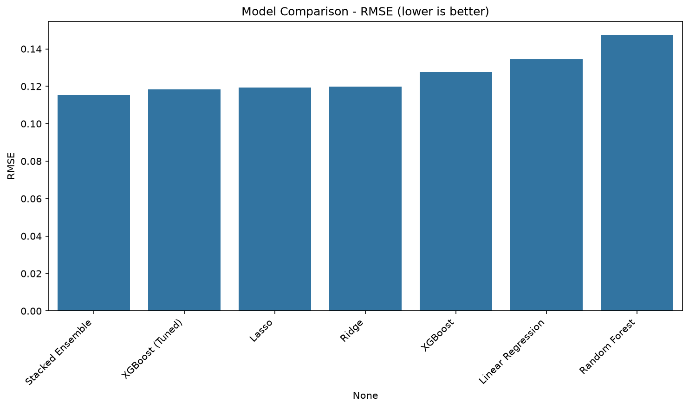
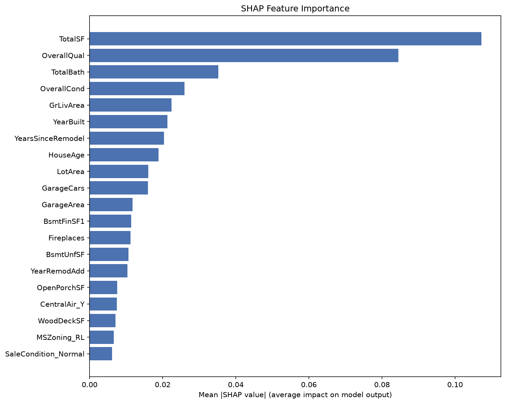
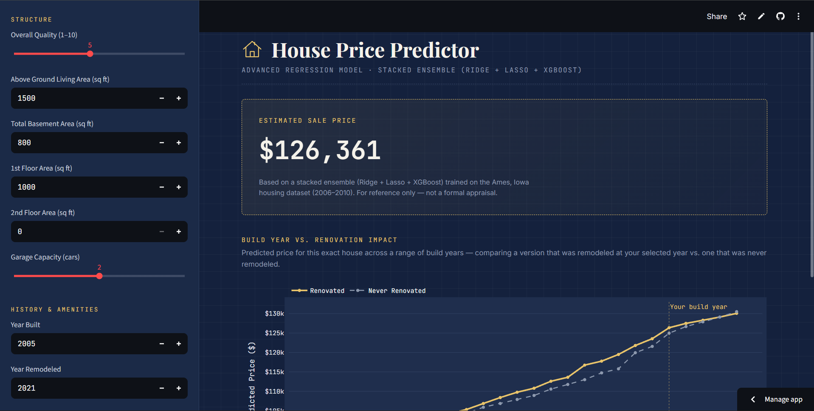

# House Price Prediction using Advanced Regression Techniques

Predicting residential house sale prices using regularized linear models, ensemble tree-based methods, hyperparameter optimization, model explainability, and a deployed interactive web app — built on the Ames, Iowa housing dataset.

**[Live Demo](https://homepricepredictionpython.streamlit.app/)** &nbsp;·&nbsp; **[Research Report](reports/Research_Report.pdf)** &nbsp;·&nbsp; **[Action Plan](reports/Action_Plan.pdf)**

---

## Overview

This project goes beyond a basic regression exercise to build a full, production-style ML pipeline:

- Structural + genuine missing-value imputation (not blanket mean/median fill)
- Domain-driven feature engineering (`TotalSF`, `TotalBath`, `HouseAge`, `YearsSinceRemodel`)
- 5 regression techniques + a stacked ensemble
- Bayesian hyperparameter tuning via **Optuna**
- Model explainability via **SHAP**
- A deployed **Streamlit** app with a live build-year/renovation impact chart
- Unit tests, modular code structure, and full documentation

## Results

| Model | RMSE | MAE | R² |
|---|---|---|---|
| Linear Regression | 0.1344 | 0.0881 | 0.8928 |
| Random Forest | 0.1474 | 0.0984 | 0.8712 |
| XGBoost (Untuned) | 0.1276 | 0.0871 | 0.9035 |
| Ridge | 0.1198 | 0.0821 | 0.9149 |
| Lasso | 0.1194 | 0.0820 | 0.9154 |
| XGBoost (Tuned via Optuna) | 0.1190 | 0.0822 | 0.9160 |
| **Stacked Ensemble (Ridge + Lasso + XGBoost)** | **0.1155** | **0.0784** | **0.9209** |

*(Metrics computed on log-transformed `SalePrice`; validation split = 20%.)*



## Explainability

SHAP analysis confirms `TotalSF` and `OverallQual` as the dominant price drivers, consistent with correlation analysis — validating the model's behavior against domain intuition rather than relying on a black box.



## Web App

A Streamlit app lets users input house details and get an instant predicted price, along with a chart showing how predicted price shifts across build years — with and without renovation.



## Tech Stack

`Python` `pandas` `numpy` `scikit-learn` `XGBoost` `Optuna` `SHAP` `Streamlit` `Plotly` `pytest`

## Project Structure

```
house-price-prediction/
├── app/                  # Streamlit web app
├── data/
│   ├── raw/              # Original Kaggle dataset
│   └── processed/        # Cleaned, feature-engineered data
├── models/               # Saved trained model + column reference
├── notebooks/            # EDA, feature engineering, modeling notebook
├── reports/
│   ├── figures/          # Saved plots (EDA, SHAP, model comparison)
│   ├── Research_Report.docx
│   └── Action_Plan.docx
├── src/                  # Reusable pipeline modules
├── tests/                # Unit tests (pytest)
└── requirements.txt
```

## Setup & Usage

```bash
# Clone the repo
git clone https://github.com/SnehaGupta0206/Home_Price_Prediction_using_streamlit.git
cd Home_Price_Prediction_using_streamlit

# Create and activate a virtual environment
python -m venv venv
venv\Scripts\activate        # Windows
source venv/bin/activate     # Mac/Linux

# Install dependencies
pip install -r requirements.txt

# Run the notebook
jupyter notebook notebooks/EDA_01.ipynb

# Run the web app
streamlit run app/streamlit_app.py

# Run tests
pytest tests/ -v
```

## Key Findings

- The target variable `SalePrice` is right-skewed (skew = 1.88); a log transform was applied before training.
- Engineered feature `TotalSF` (0.83 correlation) outperformed every raw feature, including `OverallQual` (0.79).
- Regularized linear models (Ridge, Lasso) outperformed untuned tree-based models — consistent with Optuna selecting a shallow `max_depth=2` for the best XGBoost configuration, suggesting largely near-linear relationships in this dataset.
- Stacking Ridge + Lasso + tuned XGBoost outperformed every individual model.

## Dataset Note

This project uses the **Ames Housing dataset** rather than the Boston Housing dataset, which was removed from mainstream libraries (e.g. scikit-learn) due to a feature encoding a racial demographic proxy. Ames offers a richer feature set (79 variables) without this issue.

